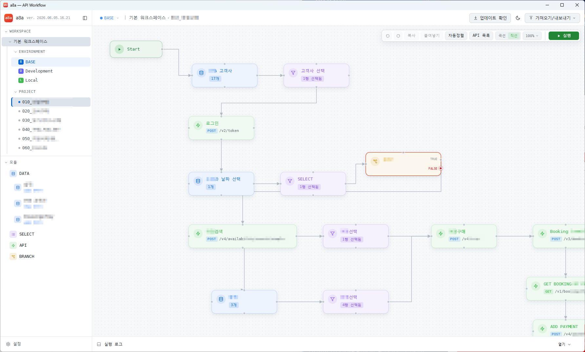

# a8a

[Korean](README.md) | [English](README.en.md)

a8a is an Electron-based workflow automation tool for visually building and running API call flows on a canvas.

You can manage workspaces, environments, and projects, then connect Data, Select, API, Branch, and End nodes to build API processing pipelines. Execution results are available as per-node INPUT/OUTPUT and logs, and End nodes can save HTML or Markdown reports.



## Download And Install

The latest installers are available from GitHub Releases.

- Download page: https://github.com/hanbroz/a8a/releases/latest
- Windows installer: `a8a-Setup-yyyy.MM.dd.HH.mm.exe`
- Windows portable file: `a8a-Portable-yyyy.MM.dd.HH.mm.exe`
- macOS Apple Silicon installer: `a8a-Mac-arm64-yyyy.MM.dd.HH.mm.dmg`
- macOS Intel installer: `a8a-Mac-x64-yyyy.MM.dd.HH.mm.dmg`
- Version format: `yyyy.MM.dd.HH.mm`

### Install On Windows

1. Open the download page.
2. Download `a8a-Setup-yyyy.MM.dd.HH.mm.exe` from the `Assets` section.
3. Run the downloaded installer.
4. Choose the install location and complete installation.
5. Start `a8a` from the desktop shortcut or Start menu.

Windows may show an "Unknown publisher" or SmartScreen warning. The current distribution may not be code-signed, so confirm that the file came from your organization or trusted GitHub Release before running it.

If you need to run without installation, download and run `a8a-Portable-yyyy.MM.dd.HH.mm.exe`. The portable file can be shared as a single executable, but the installer is recommended for standard internal distribution and update handling.

### Use On macOS

Download the `.dmg` file for your Mac CPU.

- Apple Silicon Mac: `a8a-Mac-arm64-yyyy.MM.dd.HH.mm.dmg`
- Intel Mac: `a8a-Mac-x64-yyyy.MM.dd.HH.mm.dmg`

Open the downloaded `.dmg` file and drag `a8a` into the `Applications` folder. If a `.zip` file is provided, unzip it and move the resulting `a8a.app` into `Applications`.

The current macOS build may not be Apple code-signed or notarized. If macOS shows an "unidentified developer" warning, right-click the app in Finder, choose `Open`, then choose `Open` again in the confirmation dialog. Only run files that you received from a trusted internal source or trusted GitHub Release.

If a macOS installer is not available, developers can run the app locally:

```bash
npm install
npm run dev
```

To build macOS installers yourself, run this on macOS:

```bash
npm run build:mac
```

To distribute the macOS app without Gatekeeper warnings for general users, Apple Developer code signing and notarization must be configured.

## Updates

a8a shows the current version in the app and checks the latest GitHub Release.

- The current version appears in the top-left corner as `a8a`, `ver. yyyy.MM.dd.HH.mm`.
- When the app starts, it shows an update notification if the latest Release is newer than the current version.
- The top update button can manually check for the latest version.
- If an update is available, the app can download and apply the new installer.

Update comparison uses the date version format `yyyy.MM.dd.HH.mm`. For example, if the current version is `2026.06.01.10.11` and the latest Release is `2026.06.01.14.30`, the app treats it as a newer version.

For in-app updates, a8a downloads the installer and compares its SHA-256 hash with the `.sha256` file uploaded to the same Release. If the checksum is missing or does not match, the installer is not executed.

On Windows, applying an update runs the downloaded installer and closes the app. On macOS, a8a downloads the `.dmg` or `.zip` file for the current CPU and opens it in Finder. macOS users then replace the existing `a8a.app` in `Applications`.

The Windows installer shows a summary of the main updates during installation. The portable file has no installer flow, so it does not show this update notes screen.

The npm package version in `package.json` is project metadata. The user-facing app version and Release file names use the date version recorded in `src/main/appVersion.ts`.

## Key Features

- Workspace, environment, project, and module management
- Drag to reorder projects inside the same workspace
- Duplicate an existing project canvas and edges into a new project
- Automatically create Start/End nodes when creating a project
- Build workflows with Data, Select, API, Branch, and End nodes
- Multi-select, move, copy, paste, delete, undo, and redo modules on the canvas
- View the API list in execution order based on connections
- Repeat execution from the Start node by count or data file
- Run Pre Request and Post Response scripts in API nodes
- Rebuild the next OUTPUT in Post Response scripts
- Branch TRUE/FALSE execution paths
- Replace environment variables and update them during execution with `setEnv()`
- Reference repeat data with `<<no>>` and `<<columnName>>`
- Execute sequentially from START through connected paths
- Inspect per-node INPUT, OUTPUT, and execution logs
- Save HTML or Markdown reports from End nodes
- Show and copy selected environment variable values inside End nodes
- Export/import by workspace or project
- Automatically choose Korean or English from the operating environment, with manual language settings
- Remember the selected light/dark theme
- Check and download updates from GitHub Releases

## How To Use

### 1. Create A Workspace

1. Start the app.
2. Create a workspace from the left sidebar.
3. Create a project inside the workspace.
4. Click the project name to open its canvas.
5. Click the duplicate icon on a project row, enter a new project name, and a duplicated project appears below the original.
6. Drag projects inside the same workspace to reorder them.

Use workspaces for separate business areas, customers, or testing scopes. A project should normally represent one API flow or one test scenario.

When the left sidebar is collapsed, each project is shown as a 1-3 character badge generated from the project name after removing numeric prefixes and separators. For example, `010_여정생성` can appear as `여정`, so projects remain distinguishable even when collapsed. Hover the badge to see the full workspace and project name.

### 2. Export And Import

The top `Import/Export` menu works like Postman's Export/Import. It is not a generic save button; it is used to share workspace or project data with other developers.

- `Export current workspace`: saves the current project's workspace, including environments, projects, canvases, edges, and referenced shared DATA, as a `.json` file.
- `Export current project`: saves the current project's canvas, edges, and referenced shared DATA as a `.json` file.
- `Import workspace`: imports an exported workspace file as a new workspace.
- `Import project`: imports an exported project file as a new project under the current workspace.

Imports create new IDs to avoid conflicts with existing data. If a name already exists, `(import)` is appended to the imported name.

Import files must use the `a8a.export` v1 format. Project node IDs, types, coordinates, sizes, and edge endpoints must all be valid. Damaged files or files with broken edges are rejected; a8a shows an error and does not partially import them.

The selected light/dark theme from the top theme button is remembered after closing the app.

### 3. Language Settings

Click `Settings` at the bottom of the left sidebar to open the app settings page.

You can choose one of three language options:

- `System default`: use Korean when the operating environment language is Korean; otherwise use English.
- `한국어`: always use the Korean UI.
- `English`: always use the English UI.

Language changes apply immediately and remain after closing and reopening the app. On first run, or when no language has been manually selected, `System default` is used.

Language switching applies to the app shell, sidebar, settings page, top menu, update notices, import/export dialogs, execution logs, workspace/project/environment modals, canvas floating menu, main delete confirmation dialogs, START/DATA/SELECT/API/BRANCH/END module settings, script execution errors, repeat data attachment errors, and HTML/Markdown report text.

### 4. Configure Environment Variables

Open a workspace environment to register API URLs, auth tokens, and common request values.

Example:

```text
baseUrl = https://api.example.com
token = ey...
officeId = ICN
```

In API settings, use environment variables like `{{baseUrl}}/booking/search`. Environment variable names are case-sensitive, so use consistent names inside a project.

Clicking a project's environment entry is only for viewing or editing environment settings. It does not automatically change the canvas selection or execution environment.

### 5. Place Modules On The Canvas

The Modules area contains the `DATA`, `SELECT`, `API`, and `BRANCH` types. Drag one onto the canvas to create a new module.

Every module placed on the canvas is independent. Even if two modules were created from the same type or copied from another module, each module has separate settings, INPUT, OUTPUT, and execution logs.

When you copy and paste modules, the relative positions inside the copied group are preserved and the new group is placed at the center of the currently visible canvas. INPUT paths that referenced modules inside the copied group are automatically remapped to the new module IDs so they do not mix with original module execution values.

Select multiple modules by dragging on the canvas, then press `Delete` to show a delete confirmation. Confirming deletes only the selected normal modules and their edges. `Start` and `End` modules are excluded from deletion.

Use the undo/redo buttons in the canvas floating menu to revert or reapply module creation, deletion, movement, resizing, settings saves, paste operations, and edge changes. Shortcuts are `Ctrl+Z` for undo and `Ctrl+Y` or `Ctrl+Shift+Z` for redo. History is stored per project canvas and remembers up to 10 steps.

Canvas position and zoom are saved separately per project. Moving or zooming project A does not affect project B. When you reopen project A, its previous canvas state is restored.

A typical flow is:

```text
Start -> Data or API -> Select or Branch -> API -> End
```

Create edges by dragging module ports. The flow should start from `Start` and reach `End`. Execution only includes paths reachable from `Start`.

### 6. Module Guide

#### START

The START module begins the workflow. It supports manual execution, scheduled execution, and repeat execution.

When repeat execution is enabled, choose one of two modes:

- `Repeat count`: repeat the executable flow from `Start` the specified number of times.
- `Data`: attach a `.xlsx`, `.csv`, or `.json` file and repeat once per data row.

Data files must be table-shaped. Excel and CSV use the first row as headers, and JSON must be an array of objects.

```json
[
  { "origin": "ICN", "destination": "NRT" },
  { "origin": "NRT", "destination": "ICN" }
]
```

After attaching data, the START settings screen shows the file name, row count, and preview table. The data list can scroll, open fullscreen, and search by column name or value.

If the attached file has a problem or must be replaced, attach a new file. Reattaching resets the previous data and row-level success/failure states, then applies the new data.

Repeat data automatically gets a virtual `no` column. The first row is `1`, the second row is `2`, and so on. If the attached data already contains a `no` column, the app's virtual `no` value takes precedence.

During repeat execution, all modules can reference the current row values:

```text
<<no>>
<<origin>>
<<destination>>
```

For example, API URLs, headers, query parameters, bodies, SELECT/API scripts, and BRANCH conditions can use the current repeat row values.

While repeat execution is running, the START module on the canvas shows progress such as `1/10`. This indicates the current repeat number and total count. After repeat execution finishes, the last run count remains visible until the next run.

The START settings data list also shows row execution status:

- `Pending`: the row has not run yet.
- `Running`: the row is currently running.
- `Success`: the row completed successfully through End.
- `Failed`: an error occurred while running the row.

If `Stop on failure` is checked, the entire repeat run stops immediately when one row fails. If unchecked, a failed row is marked `Failed`, the remaining modules for that row are skipped, and execution continues with the next row.

After a repeat run finishes, if any rows failed, use `Export failed` in the START settings screen to export only failed rows to Excel. The saved `.xlsx` file includes the original data columns plus `Failure status`, `Failed module`, and `Failure reason`. You can edit this file and attach it again to rerun only failed cases.

If report generation is enabled in the End module during repeat execution, each repeat row creates its own report file. The repeat report file name appends ` - <<no>>` to the existing `{ENV} {WS} {PROJECT} {TS}` format. During repeat execution, a file-created popup is not shown for every report.

#### DATA

The DATA module creates OUTPUT by direct JSON input or by loading Excel/CSV data. The next module receives DATA OUTPUT as INPUT.

DATA modules are independent by default for each node on the canvas. If multiple projects need to share the same customer information, reference data, or code list, enable `Share as common DATA` in the DATA settings screen and save.

Shared DATA appears under `DATA` in the left `Modules` area. Dragging it onto another project canvas creates a new DATA node, but the actual OUTPUT data references the shared DATA source. Editing and saving the shared data from any node updates the data used by every project node that references the same shared DATA.

If shared DATA is no longer needed, disable `Share as common DATA` in the DATA settings screen and save. The current canvas DATA node copies the current data into an independent DATA node, while the existing shared DATA source remains available.

Common uses:

- Prepare test request data
- Use Excel rows as repeated API call data
- Pass fixed JSON values to the next API

#### SELECT

The SELECT module chooses required rows or JSON paths from the previous module's OUTPUT.

SELECT INPUT can be viewed in three ways:

- The default tab is `TREE`.
- `JSON`: view and edit the original JSON.
- `TREE`: expand the JSON structure and choose required paths.
- `Table`: display object-array input as a table and choose rows.

Common uses:

- Select specific rows from an API response array
- Extract required fields from a JSON object
- Ask the user to choose values during execution

Use `Select without asking` to automatically select with the saved criteria.

The JSON selection window can be expanded to fullscreen. When you open the same SELECT module again, the previous selection and JSON tree expand/collapse state are preserved, so complex JSON does not need to be reopened path by path during repeated tests.

#### API

The API module calls HTTP APIs. It supports URL, Method, Header, Query Parameter, Body, authentication, Pre Request, and Post Response settings.

New API modules include a default `Content-Type: application/json` header. Header and Query rows give more space to Value than Key so long values are easier to inspect.

For long JSON bodies, click the fullscreen icon in the Body area to edit in a wider screen. Changes in the fullscreen editor are applied directly to the API module Body, and `Format JSON` can make the body easier to read.

Monaco editors used for JSON, INPUT/OUTPUT, Pre Request, and Post Response automatically follow the app's dark/light theme.

API URLs often start with an environment variable:

```text
{{baseUrl}}/v1/bookings
```

On canvas API cards and in the API list, `{{environment}}`, `[[INPUT]]`, and `<<DATA>>` variables are replaced with values when a value can be determined. However, the first `{{environment}}` variable in the URL is hidden. This keeps repeated base URLs such as `{{baseUrl}}` from obscuring the endpoint. Remaining variables are shown as real values when they can be found from the module execution INPUT, the current START repeat row, or the preview row.

When you choose a JSON value in API INPUT mappings, the saved default path uses a node-independent form such as `output[0]` instead of being tied to the upstream module ID. This keeps the same field usable when a conditional flow changes which SELECT module provides the input. After selecting from the tree, you can still edit the path manually, for example `[[amount * -1]]` or `$get("amount")`.

An API module sends exactly one HTTP request per node execution, even when its INPUT is merged from multiple nodes or contains an array value. To process multiple records, split execution explicitly with START repeat execution.

When you give a module a long name, the initial canvas card width expands automatically to fit the name when saved. Modules that have already been resized wider are not reduced.

#### BRANCH

The BRANCH module evaluates TRUE/FALSE and splits execution paths.

BRANCH does not create new data. It only evaluates the condition and passes the previous module's OUTPUT DATA unchanged to the next module.

After execution, the selected TRUE/FALSE path is shown with the same color as the BRANCH module on ports and labels. The selected path remains visible in the light theme.

If the BRANCH value is already fixed to TRUE or FALSE instead of using a condition or user choice, the matching TRUE/FALSE port is emphasized before execution so the fixed path is visible from the canvas card.

Common uses:

- Use TRUE when a response value exists, FALSE when it does not
- Call a different API when an amount is greater than a threshold
- Let the user manually choose TRUE/FALSE during execution

#### END

The END module terminates the workflow. It can save selected module execution results as HTML or Markdown reports.

END can be the join point for multiple execution paths. Multiple modules or BRANCH TRUE/FALSE paths can connect to one END module, and both TRUE and FALSE paths of the same BRANCH can connect to the same END.

In END settings, choose environment variable keys to display inside the module. Available keys come from the BASE environment and the current execution environment. After execution finishes, selected values appear inside the End module and can be copied individually.

This feature does not hardcode any specific variable name. For example, an airline reservation workflow may choose `PNR` or `recordLocator`, while another workflow may choose `orderId`, `bookingId`, or `token`. If many values are selected, the End module height increases so all values can be shown.

END report targets can only include modules on connected execution paths from START to END. If you save END settings and later add a new module into the connected execution path, the new module is included in report targets by default. Modules that a user explicitly unchecked remain excluded.

In END report settings, choose whether the report includes `INPUT`, `OUTPUT`, `PRE REQUEST`, `POST RESPONSE`, and `Used variables`. Existing END settings behave as if all items are included. Unchecked items are excluded from future HTML/Markdown reports. API module URL, request headers, request body, and response body are always included as API execution evidence, regardless of the `INPUT` or `OUTPUT` checkbox state.

### 7. Review API Flow With API List

Click `API List` in the canvas floating menu to show APIs in connection-based execution order.

The list is displayed as a table:

```text
# | Module | Method | URL
```

URLs are shown in full with resolvable variables applied. The API list expands to show all items without internal scrolling. Clicking a row moves the canvas to that API module, selects it, and focuses it. Use this to verify that the full API flow is ordered by the expected endpoints.

Use the mouse wheel on the canvas to freely zoom between `30%` and `200%`. The current zoom appears on the `%` button in the floating menu.

Click the zoom ratio button, such as `100%`, to choose `Fullscreen`, `200%`, `100%`, `50%`, or `30%`. These items are presets for quick navigation. `Fullscreen` hides the sidebar, topbar, and execution log so only the canvas remains. In fullscreen mode, the first menu item changes to `Close`, which returns to the normal layout.

### 8. Run A Workflow

Run the full canvas with the `Run` button on the far right of the canvas floating menu. After execution results are visible, the same area shows `Reset`, which clears execution state and logs.

While running, the same button shows `Running` with a loading indicator. Clicking it asks whether to stop; confirming stops at the current state and changes the button to `Reset`. `Ctrl+Enter` runs on Windows/Linux and `Cmd+Enter` runs on macOS. If results are already visible, the shortcut resets first and then starts a new run.

The execution log action button shows `Open` while the log is closed and `Close (Esc)` while it is open. When the execution log is open, press `Esc` to close it.

Execution rules:

- Only modules connected from `Start` are executed.
- Unconnected modules are not executed.
- If an error occurs, the full execution stops immediately.
- You can inspect per-node INPUT, OUTPUT, status, and execution logs.
- API module execution logs include the actual request URL, headers, body, response body, and cURL command.
- API modules send exactly one HTTP request per node execution even when INPUT has multiple sources or array values.
- The Run button inside a module settings dialog only runs the path from `Start` to that module and refreshes the INPUT/OUTPUT preview.

## API Script Guide

API modules include `Pre Request` and `Post Response` scripts.

New API scripts start with `const input = getInput();` for Pre Request and `const output = getOutput();` for Post Response. These default lines help users access INPUT/OUTPUT immediately, and they can be edited or deleted.

Click the help icon in each script area to view available functions and sample code. Use the `Copy` button in a sample to copy it directly to the clipboard.

### Pre Request

Pre Request runs before the API call. Use it to create values for request templates or set environment variables.

Main functions:

```javascript
const input = getInput();

setInput("passengerCount", 2);
setEnv("token", "new-token");
console.log(input);
```

Values set with `setInput(name, value)` can be used in URL, Header, Query, and Body templates as `[[passengerCount]]`.

The current START repeat row values can be referenced with `<<columnName>>`.

Template values inside `{{ }}`, `[[ ]]`, and `<< >>` support simple expressions as well as direct references. For example, use `[[passengerCount * 1]]` for numbers, `[[passengerName.replace(/\s+/g, '')]]` for strings, `{{baseUrl.replace(/\/$/, '')}}` for environment variables, and `<<no * 1>>` for repeat data. Keys with spaces or special characters can still be used as direct references, and expressions can read them with `$get("columnName")`.

```javascript
const input = getInput();

console.log(input.no);
console.log(input.origin);
```

`<<columnName>>` is a START repeat DATA expression. It is not an expression selected from the previous module's INPUT JSON like `[[variableName]]`; it finds the value from the current repeat row created by START. Therefore `<<no>>` always exists during repeat execution and can be used by every downstream module connected from START in URLs, headers, queries, bodies, API/SELECT scripts, and BRANCH conditions.

When an actual repeat row is not yet available, such as in a settings preview, a8a uses the first START repeat data row as the preview value. In data repeat mode this is the first row value, and in count repeat mode `<<no>>` is shown as `1`. Use `[[variableName]]` for values selected from INPUT JSON and `<<columnName>>` for START repeat data row values.

### Post Response

Post Response runs after receiving the API response. Use it to simplify complex responses into a new OUTPUT or extract values for the next API.

Main functions:

```javascript
const output = getOutput();

setOutput({
  id: output.id,
  name: output.name,
});

setEnv("recordLocator", output.recordLocator);
```

`getOutput()` returns the current API response. If the response result has one item, it is passed as a single object/value. If it has multiple items, it is passed as an array. A single API response object is not wrapped in an array in OUTPUT.

`setOutput(value)` replaces the entire final OUTPUT of the current API module.

```javascript
const output = getOutput();

setOutput({
  from: Object.values(output.results[0].trips[0].journeysAvailableByMarket)[0],
  to: Object.values(output.results[1].trips[0].journeysAvailableByMarket)[0],
});
```

`setOutput(name, value)` adds a field to the OUTPUT object. Multiple calls are accumulated into one object.

```javascript
const output = getOutput();

setOutput("from", Object.values(output.results[0].trips[0].journeysAvailableByMarket)[0]);
setOutput("to", Object.values(output.results[1].trips[0].journeysAvailableByMarket)[0]);
```

The final OUTPUT becomes:

```json
{
  "from": [],
  "to": []
}
```

For step-by-step OUTPUT construction, use the `Output` helper object.

```javascript
const output = getOutput();
const next = new Output();

next.add("from", Object.values(output.results[0].trips[0].journeysAvailableByMarket)[0]);
next.add("to", Object.values(output.results[1].trips[0].journeysAvailableByMarket)[0]);

setOutput(next);
```

OUTPUT created with `setOutput(value)` is passed as INPUT to the next module and appears as that OUTPUT in execution logs and reports.

## Development

Required tools:

- Node.js 22 or later
- npm
- Windows environment for building Windows installers
- macOS environment for building macOS installers

Install dependencies:

```bash
npm install
```

Run the development server:

```bash
npm run dev
```

Verify a production build:

```bash
npm run build
```

When features, settings, usage, or distribution behavior change, update both `README.md` and `README.en.md` in the same change.

On Windows, convenience scripts are also available:

```bat
dev.bat
run.bat
```

On Unix-like shells:

```bash
./dev.sh
./run.sh
```

## Local Installer Builds

To build the Windows installer:

```powershell
$version = Get-Date -Format 'yyyy.MM.dd.HH.mm'
$env:A8A_UPDATE_GITHUB_REPO = "hanbroz/a8a"
$env:A8A_APP_VERSION = $version

npm run version:stamp -- $version
npm run build:win
```

After the build, `dist/` contains:

```text
dist/a8a-Setup-yyyy.MM.dd.HH.mm.exe
dist/a8a-Setup-yyyy.MM.dd.HH.mm.exe.blockmap
dist/a8a-Portable-yyyy.MM.dd.HH.mm.exe
```

Build macOS installers on macOS:

```bash
export A8A_UPDATE_GITHUB_REPO="hanbroz/a8a"
export A8A_APP_VERSION="$(date '+%Y.%m.%d.%H.%M')"

npm run version:stamp -- "$A8A_APP_VERSION"
npm run build:mac
```

`npm run build:mac` creates `build/icon.icns` from `build/icon.png`, then builds `.dmg` and `.zip` files for Apple Silicon(`arm64`) and Intel(`x64`). To build for only one CPU type:

```bash
npm run build:mac:arm64
npm run build:mac:x64
```

After the build, `dist/` contains:

```text
dist/a8a-Mac-arm64-yyyy.MM.dd.HH.mm.dmg
dist/a8a-Mac-arm64-yyyy.MM.dd.HH.mm.zip
dist/a8a-Mac-x64-yyyy.MM.dd.HH.mm.dmg
dist/a8a-Mac-x64-yyyy.MM.dd.HH.mm.zip
```

macOS installers cannot be built reliably on Windows. To distribute `.dmg` and `.zip`, build on macOS or on a GitHub Actions macOS runner.

Build Linux packages on Linux:

```bash
npm run build:linux
```

## Release Process

Important release rule: every new release is published by directly uploading locally built artifacts to GitHub Release. GitHub Actions is only supporting automation or verification; local build artifacts are the distribution source of truth.

The current GitHub Actions Release workflow may fail because of billing or spending-limit issues. Therefore, the standard release process is to build Windows locally and manually create the GitHub Release. To also provide macOS files, build `.dmg` and `.zip` on macOS with the same version number and upload them to the same Release.

The release process is always the same:

1. Commit and push feature and documentation changes first.
2. Update `build/installer-release-notes.nsh` and `build/release-notes.md` with the release notes for this version.
3. Run the manual release command below.
4. The command calculates the current time as `yyyy.MM.dd.HH.mm`.
5. The app display version is stamped with that date version.
6. Windows installer and portable files are built.
7. If macOS files are required, build `.dmg` and `.zip` on macOS with the same version number.
8. Commit and push the version stamp.
9. Create a GitHub Release with the `vyyyy.MM.dd.HH.mm` tag.
10. Upload installer, blockmap, portable, and macOS files as Release assets with the `build/release-notes.md` body.

```powershell
npm run release:manual
```

To release with a specific version:

```powershell
npm run release:manual -- -Version 2026.06.02.12.54
```

The default repository is `hanbroz/a8a`. To publish to another repository:

```powershell
npm run release:manual -- -Repo owner/repo
```

The manual release command performs these actions. It targets Windows installer and portable files; macOS files must be built separately on macOS and added to the same Release.

1. Stamp the app version with `npm run version:stamp -- <version>`.
2. Build installer and portable versions with `npm run build:win`.
3. Commit only the `src/main/appVersion.ts` version change.
4. Push the current branch.
5. Create the latest Release and upload assets with `gh release create`, using `build/release-notes.md` as the Release body.

Release assets include:

```text
dist/a8a-Setup-yyyy.MM.dd.HH.mm.exe
dist/a8a-Setup-yyyy.MM.dd.HH.mm.exe.sha256
dist/a8a-Setup-yyyy.MM.dd.HH.mm.exe.blockmap
dist/a8a-Setup-yyyy.MM.dd.HH.mm.exe.blockmap.sha256
dist/a8a-Portable-yyyy.MM.dd.HH.mm.exe
dist/a8a-Portable-yyyy.MM.dd.HH.mm.exe.sha256
dist/a8a-Mac-arm64-yyyy.MM.dd.HH.mm.dmg
dist/a8a-Mac-arm64-yyyy.MM.dd.HH.mm.dmg.sha256
dist/a8a-Mac-arm64-yyyy.MM.dd.HH.mm.zip
dist/a8a-Mac-arm64-yyyy.MM.dd.HH.mm.zip.sha256
dist/a8a-Mac-x64-yyyy.MM.dd.HH.mm.dmg
dist/a8a-Mac-x64-yyyy.MM.dd.HH.mm.dmg.sha256
dist/a8a-Mac-x64-yyyy.MM.dd.HH.mm.zip
dist/a8a-Mac-x64-yyyy.MM.dd.HH.mm.zip.sha256
```

Share files depending on how developers will use the app:

- For installed use, share `a8a-Setup-yyyy.MM.dd.HH.mm.exe`.
- For running without installation, share `a8a-Portable-yyyy.MM.dd.HH.mm.exe`.
- For Apple Silicon Mac users, share `a8a-Mac-arm64-yyyy.MM.dd.HH.mm.dmg`.
- For Intel Mac users, share `a8a-Mac-x64-yyyy.MM.dd.HH.mm.dmg`.
- `.blockmap` files are for automatic updates, and `.sha256` files are for update verification, so they do not need to be shared directly with users.

The Windows installer update notes screen is configured by `build/installer.nsh` and `build/installer-release-notes.nsh`. For each new version, replace the `A8A_INSTALLER_RELEASE_NOTES` text in `build/installer-release-notes.nsh` with the new update summary before building. GitHub Release uses `build/release-notes.md`, so keep the change list in both files aligned. Use NSIS line breaks: `$\r$\n`.

If GitHub Actions becomes available again, pushing to `main` or `master` can automatically build Windows and macOS installers and create GitHub Releases. However, the official release process for this project is local build plus manual Release publication. Treat automated release flow as reference only.

1. Calculate the push time as `yyyy.MM.dd.HH.mm`.
2. Stamp the app display version with that date version.
3. Build Windows installer and portable files.
4. Build macOS Apple Silicon/Intel `.dmg` and `.zip` files.
5. Create a GitHub Release with the `vyyyy.MM.dd.HH.mm` tag.
6. Upload Windows and macOS artifacts and each `.sha256` checksum as Release assets.

If GitHub Actions does not start because of billing or spending-limit problems, no Release will be created. The repository owner must check `Settings > Billing & plans`, payment method, Actions budget, and spending limit, then rerun the workflow.

## License And Usage Terms

The a8a repository is public on GitHub, but it is not licensed as open source for commercial use. It is a source-available project published so anyone can inspect the code and use it for noncommercial purposes.

This project is provided under the `PolyForm Noncommercial License 1.0.0`. See [LICENSE.md](LICENSE.md) and [NOTICE](NOTICE) for details.

Allowed use:

- Personal learning, research, review, and testing
- Noncommercial internal review or pilot use inside an organization
- Copying, modifying, and distributing for noncommercial purposes

Required conditions:

- Do not remove original author attribution.
- Distributions, forks, modified versions, and derivative works must include the `Required Notice` text from `NOTICE`.
- Provide the license document or license URL together with the distribution.

Prohibited use:

- Commercial use without separate written permission
- Selling a8a or derivatives that include a8a
- Including a8a in paid services
- Using it in production for company, customer, or project revenue generation

For commercial use, paid features, or redistribution contracts, obtain separate permission from the original author. After the project has enough features and validation, paid licenses, sponsorship, or a "buy the developer a coffee" donation option may be added.

## Project Structure

```text
src/
  main/                 Electron main process, DB, IPC, update handling
  preload/              window.api bridge exposed to Renderer
  renderer/src/         React UI and workflow execution state
  renderer/src/components/
                          Canvas, sidebar, environment variable UI
  renderer/src/utils/   Template replacement, script runtime, report generation
docs/                   Architecture, technical debt, release documents
scripts/                Build helper scripts such as version stamping
```

## Tech Stack

- Electron
- electron-vite
- React
- TypeScript
- sql.js
- Monaco Editor
- ExcelJS

## Troubleshooting

### The Download Page Has No Installer

GitHub Actions may have failed, or the Release may not have been created yet. Developers should check the Actions result and Billing settings, then publish the release again.

### The App Cannot Find Updates

The Release tag or name must include a version in the `yyyy.MM.dd.HH.mm` format. Also, the app must be built with `A8A_UPDATE_GITHUB_REPO` recorded in the `owner/repo` format, such as `hanbroz/a8a`.

The Windows app looks for an `.exe` installer in Release assets. The macOS app looks for a `.dmg` or `.zip` file for the current CPU. To provide updates for macOS users, upload `a8a-Mac-arm64-yyyy.MM.dd.HH.mm.dmg` or `a8a-Mac-x64-yyyy.MM.dd.HH.mm.dmg` to the Release. The app also requires a `.sha256` file with the same installer name; without it, updates are blocked for safety.

### Windows Shows An Install Warning

Unsigned installers may show Windows security warnings. Confirm that the file came from your organization's GitHub Release before running it.

### macOS Shows An Unidentified Developer Warning

`.dmg` or `.app` files without Apple code signing and notarization may trigger a macOS Gatekeeper warning. Confirm that the file came from your organization's GitHub Release, then right-click the app in Finder and choose `Open`. To distribute without this warning for general users, sign and notarize the app with an Apple Developer account.
